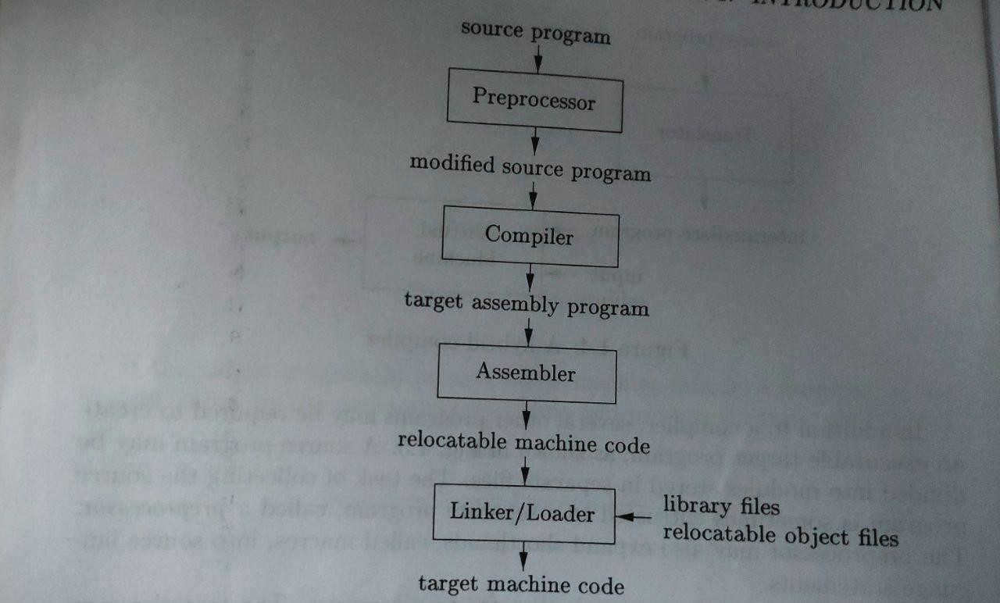

## Unit 1 Introduction

### Compiler

​	A compiler is a program that can read program in one language(source) & translate it into an equivalent program in another language(target)

### Lexeme

​	A lexeme is a sequence of characters in the source program that match pattern for a token or an instance of a token that is recognised by the  lexical analyser

### token

​	Tokens are lexeme mapped into a token-name and attribute values

**example** 

​		An example includes:
​		x = a + b * 2
​				Which yields the lexeme: {x, =, a, +, b, *, 2}
​				With corresponding tokens: {<id, 0>, <=>, <id, 1>, <+>, <id, 2>, <*>, <id, 3>}

### Language Processing System 

### Phases of Compiler

1. **Lexical Analysis**

	It reads stream of character & groups them into meaningful sequence(lexeme) & outputs token of the form  **<token-name, token-attribute>**  

2. **Syntax Analysis (Parsing)**
	It uses the first component of the token, to create  a tree-like intermediate**(syntax-tree )** representation that depicts the grammatical structure of the token stream

3. **Semantic Analysis**
	It uses the syntax-tree & the **Symbol table** to check for program for semantic consistency with language definition, like type checking

4. **Intermediate Code Generation**
	We generally use three-address code at this stage

5. **Code Optimisation**
	This is optional

6. **Code generation**

* **Symbol table**
	It is a data structure that is used by the compilers to hold information about the source program construction, It is collected during analysis phase and used during synthesis phase. Entries in the symbol table contains information the identifier such as it character string(lexeme), it type, position in storage, etc. Mostly needs to be able to perform multiple declare of the same identifier within a program. The entry is made when an identifier is declared

#### Example 

### Grouping of Phases into Passes 

There are 2 types of grouping

1. **One Pass**
	Here everything happens in one go, there is no separation like Front end, Back end 

2. **Multi Pass/Two Pass**

	Here there are two Passes 

	The Front end and Back end can be on different machines
	More than one FD(languages) can use the same BD

	1. **Front end (analysis phase)**
		- Lexical analysis
		- Syntax analysis
		- Semantic analysis
		- Intermediate code generation
	2. **Back end (synthesis phase)**
		- Code optimiser
		- Code generation

### One Pass/ Single Pass Compiler

1. Single pass compiler is faster and smaller than the multi pass compiler.

2. Single pass compiler is one that processes the input *exactly once*, so going directly from lexical analysis to code generator, and then going back for the next read.

	

**Problems with single pass compiler:**

1. We can not optimise very well due to the context of expressions are limited.
2. As we can’t backup and process, it again so grammar should be limited or simplified.
3. Single pass compiler is less efficient in comparison with multi pass compiler.
4. Command interpreters such as *bash/sh/tcsh* can be considered as Single pass compiler, but they also execute entry as soon as they are processed.

### Compiler Construction tools

1. Yacc
2. lex

---

## Unit 2 Lexical Analyser 

### The role of lexical analyser 

- It mainly **reads the characters** from the input and groups them into "**tokens objects**"
- It **removes white spaces**  & ** Comments**
- it **reads ahead**, before it returns the token to the parser, as need to know where the lexem ends(because after reading ">" the next character could be "=" making it ">=" instead of just ">")
- It also **recognises keywords & identifiers** 

### Input buffering 

- When the lexical analyser is matching for patterns, it needs to make sure that the lexeme, ends, for this it used look ahead

- Because of time required to process large amount of characters in this process special buffer technique are used, an important scheme involves 2 buffers that are alternately reloaded, Each buffer is of size *N*, *N* is the size of disk block.

- We can read *N* character in one system read  command, rather using one system call  per character, if fewer than *N* characters remain in the input file then a special character represented by **eof**(end of file) marks the end of the source file and is different from any character of the source program

- Two pointers to the input are maintained 

	- **LexemeBegin** (marks the beginning of lexeme, whose extent we are trying to determine)

	- **forward** (Scan ahead until a pattern match is found, once a lexeme is determined forward is set to the character to its right)

- As long as we don't need to look so far ahead of the actual lexeme that the sum of the lexeme length plus the distance we look ahead is grater than *N* we will never overwrite the lexeme in its buffer be 

### Specification of Tokens

### A Language for Specifying Lexical Analysers

### Design of a Lexical Analyser generator