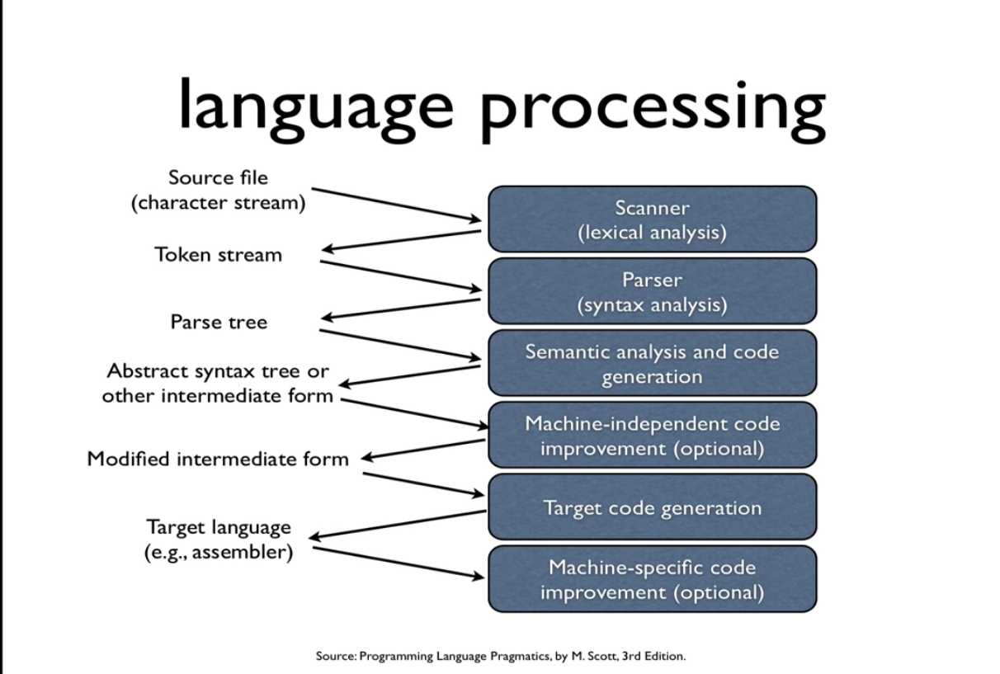
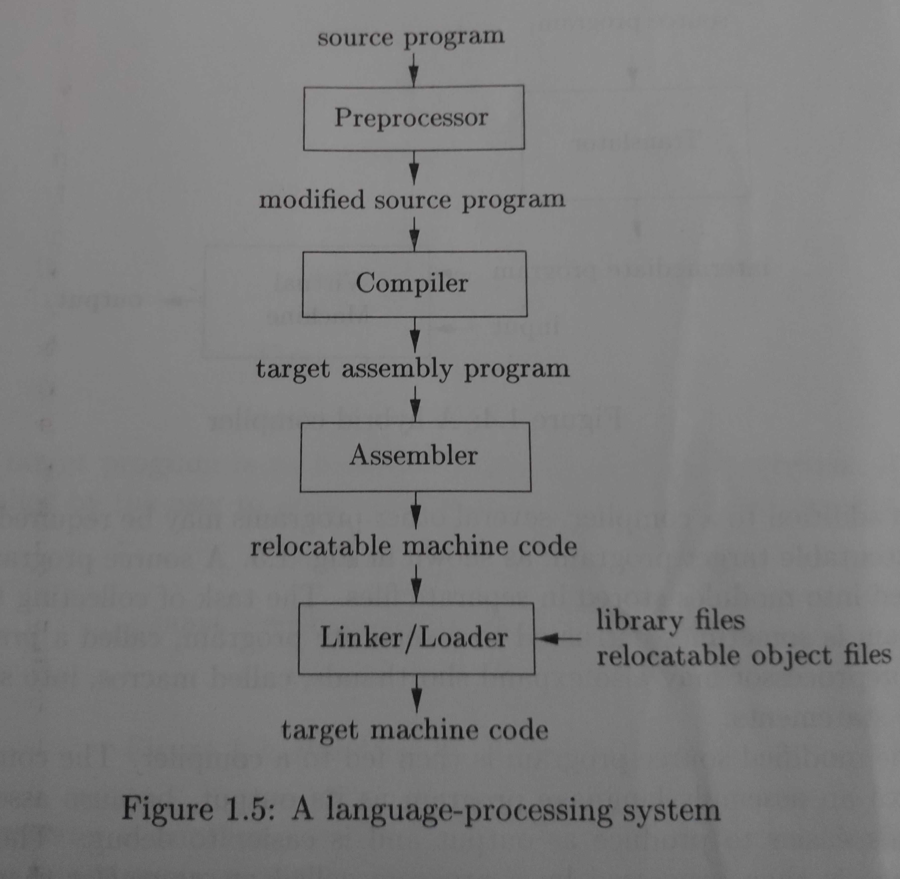
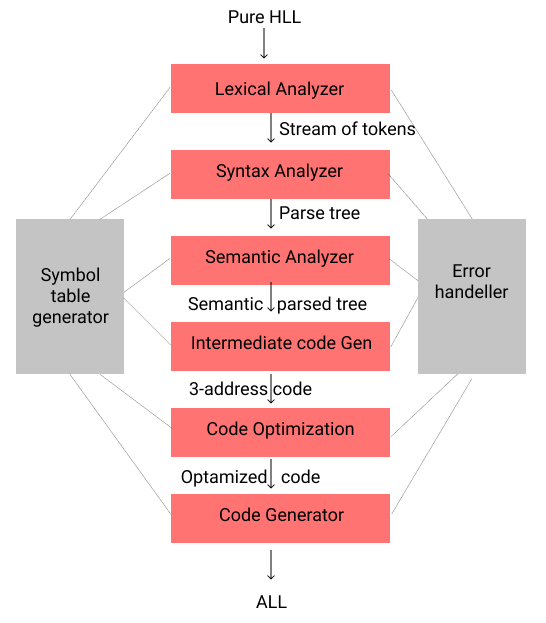
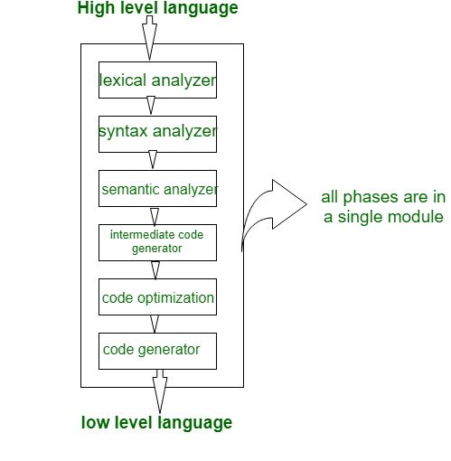
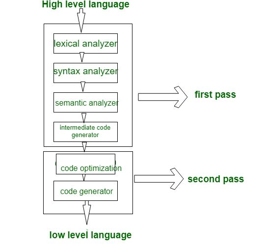
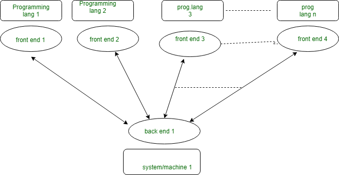
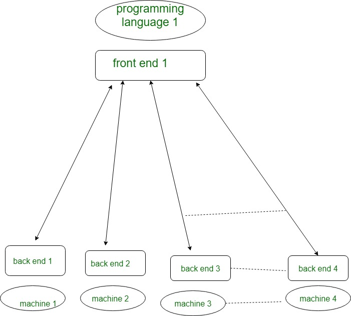

## Unit 1: Intermediate

### 	Compiler

* It is a software program that converts high level language to ALL 

### 	Lexeme

- A lexeme is a sequence of characters in the source program that matches the pattern for a token and is identified by the lexical analyzer as an instance of that token.
- Lexemes are the words derived from the character input stream.

* example 

  An example includes:
  x = a + b * 2
  Which yields the lexemes: {x, =, a, +, b, *, 2}
  With corresponding tokens: {<id, 0>, <=>, <id, 1>, <+>, <id, 2>, <*>, <id, 3>}

### Tokens

* A token is a pair consisting of a token name and an optional attribute value.
* Tokens are lexemes mapped into a token-name and an attribute-value.

* example 

  An example includes:
  x = a + b * 2
  Which yields the lexemes: {x, =, a, +, b, *, 2}
  With corresponding tokens: {<id, 0>, <=>, <id, 1>, <+>, <id, 2>, <*>, <id, 3>}

### Language processing

### Analysis of the source program & the phases of a compiler

### The grouping of phases

compiler components can be divided into two groups

1. Front end
    1. Lexical analyzer
        - Convert Pure HLL stream of tokens
        - Remove white spaces
    2. Syntax Analyzer /  Parser
        - Has language grammar
        - Ambigus grammer is converted to unambiguous using
            1. rules of associativity (Grow only in one direction)(Making it right/left recursieve)
            2. Presidance rules
        - Returns parsed tree
    3. Semantic Analyzer
        - Semantic analysis, type checking
    4. Intermediate code generator
        - Intermediate code (3-address code)
2. Back end

    5. Code Optimizer 
    6. Code Generator

### A simple one-pass compile

 If we combine or group all the phases of compiler design in a **single** module known as single pass compiler.

1. A one pass/single pass compiler is that type of compiler that passes through the part of each compilation unit exactly once.
2. Single pass compiler is faster and smaller than the multi pass compiler.
3. As a disadvantage of single pass compiler is that it is less efficient in comparison with multipass compiler.
4. Single pass compiler is one that processes the input *exactly once*, so going directly from lexical analysis to code generator, and then going back for the next read.

**Problems with single pass compiler:**

1. We can not optimize very well due to the context of expressions are limited.
2. As we can’t backup and process, it again so grammar should be limited or simplified.
3. Command interpreters such as *bash/sh/tcsh* can be considered as Single pass compiler, but they also execute entry as soon as they are processed.

### Multi pass compiler (Two pass compiler)

A Two pass/multi-pass Compiler is a type of compiler that processes the *source code* or abstract syntax tree of a program multiple times. In multipass Compiler we divide phases in two parts.

**With multi-pass Compiler we can solve these 2 basic problems:**

1. If we want to design a compiler for different programming language for  same machine.
   
2. If we want to design a compiler for same programming language for different machine/system.
   

### Compiler Construction tools

Lex

yacc

lance

## Unit 2: Lexical Analysis

### Role of lexical analyser

It converts the High level input program into a sequence of **Tokens**

- Lexical Analysis can be implemented with the **Deterministic finite Automata**
- The output is a sequence of tokens that is sent to the parser for syntax analysis
- It reads the characters in input, groups them as lexemes and gives tokens as ouput
- when it comes across a lexeme that constitutes of an identifier, it needs to enter that lexeme into the symbol table
-