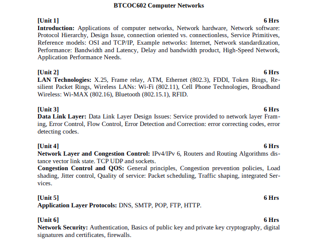
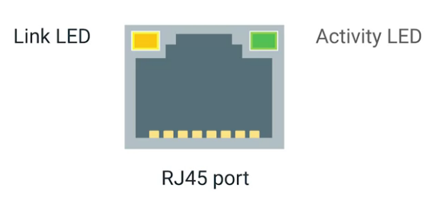
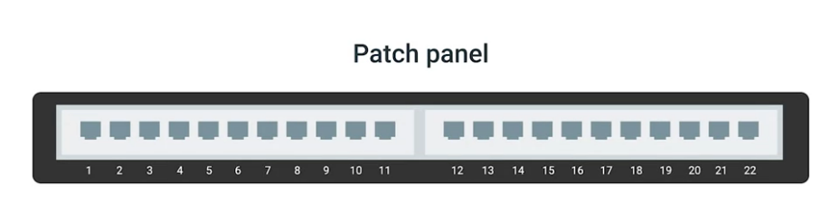
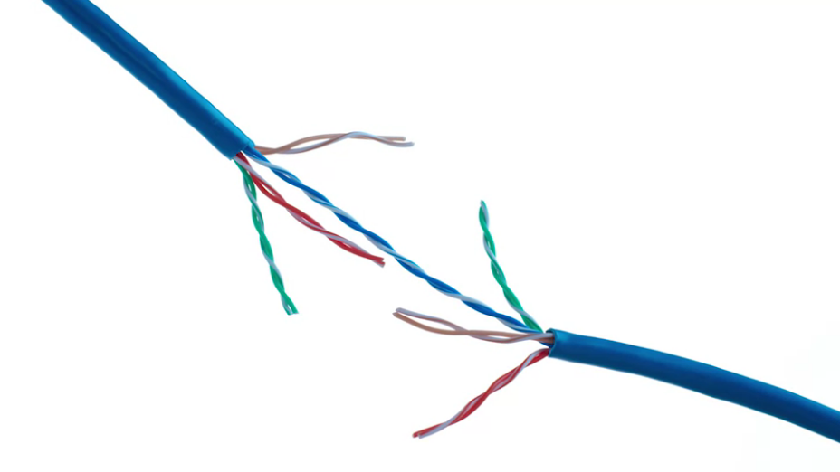

> Teacher: Prof. Neha Sayed
Semester: VI

## Syllabus

## Unit 1: Introduction

### Applications of computer networks

### Definitions

#### 	Protocol

​	A defined set of standards that computers must follow in order to communicate properly

#### 	Crosstalk

​	is when an electrical pulse on one wire is accidentally detected on another wire

####  	Collision domain

​	If multiple systems try to communicate at the same time then electrical pulses sent across the cable can interfere with each other

#### 	Modulation / Line coding

​	A way of varying the voltage of charge moving across the cable

​	It allows devices to understand that an electrical charge in a state is 0 and in other is 1

#### 	Duplex communication

​	The concept that information can flow in both direction across the cable

#### 	Full Duplex

​	Booth receiver & sender can send and receive at the same time

#### 	Half Duplex

​	Communication is possible in each direction, but only one device will be communicating at a time

#### 	Simplex Communication

​	This process is unidirectional

### OSI model

Open Systems Interconnection

There are 7 layes in OSI

1. **Application** layer (Browsers)
2. **Presentation** layer (Converts text to ASCII viversa, encrypts & decripts)
3. **Session** layer (Starting ,ending and maintaining session, getting data from website, reestablish connection if needed)
4. **Transport** layer (makes sure Packets are delivered reliably and in order ,also break down data into smaller packets)
5. **Network** layer (Determine best route for data) (Routers)
6. **Data link** layer (Check for errors, if error send data again) (Network interphase card)
7. **Physical** layer (Physical medium, cable, wifi, any electrical signal, physical transmission of data)

### IP

It is connection less(data gram service)

### TCP

- It creates segments(Collection of bytes)

- It is connection oriented

- Full Duplex

- Piggybacking (Can send data with Acknowledgment) (GoBachN & Selective Repeat)

- It has 5 layers

  

1. Physical layer 

   - It represents the physical devices that interconnect computers
   - E.g :- specification for cables and connectors, specification on how to send information over these connections.

2. Data link layer(Network access layer)

   - It determines a common way of interpreting these signals so network devices can communicate
   - Ethernet standards also define a protocol responsible for getting data to nodes on the same network or link

3. Network layer (Internet layer)

   - It allows different networks to communicate with each other through routers
   - IP(Internet protocol)  protocol is used here
   - A collection of nodes connected though routers is called internetwork (e.g internet)

4. Transport layer

   - Sorts out which applications  on node are suppose too get the data.
   - TCP (Transmission Control Protocol) is the protocol used here
   - We also have other protocol like (UDP (User Datagram Protocol) )

   TCP provides mechanisms to ensure that data is reliably delivered, while this is not present in UDP

5. Application layer

   * Many protocol

    

### Physical Layer

* It consists of devices and means to transmit bits across network
* In copper wire we use **modulation / Line Coding** (way to vary voltage of charge moving across the cable) (It allows devices to understand that an electrical charge in a state is 0 and in other is 1)
* Ethernet port is called "RJ45 plug" **(Register jack 45)**, its the most common plug, 
*  
* 
* Link light is led when the cable is correctly connected to 2 devices, that are booth on
*  Activity light will flash when data is transmitted across the cable
* On **switches** both these may  be combined and one one led may be used 

### Network hardware

All computer network is made up of 

1. nodes
2. communication media

All devices in a network (computers, modems, routers, switches) are called "node", 

Any thing that is used to connect all nodes is called "communications media"

1. Modem
    - Digital to analog, that can send through copper wire
    - Connects internet to home network
    - DOCSIS (protocol)
    - Chanels (Downstream & upstream, e.g 8x4)
2. router
    - Wireless/wired
    - Where all devices connect to, routers networks together (home network & internet)
    - To decide best route
3. Switch / Patch panel
    - It gives us more ports for ethernet cables
    - It is also a repeater in it self
    - 
4. Repeaters/Extenders/Amplifier
    - It takes a signal and redistribute it
    - They can be wired and wireless

###  Hardware Devices

1. Cables
    - Copper 
      - (User variation in electrical voltages ) - 
      - (ex: Cat5, Cat5e and Cat6) (Category) 
        - No of twists pairs are arranged usable ranges, Transfer speed, reliably
        - cat5e has more protection against Crosstalk and cat6 even more 
        - Cat6 are expensieve, but they have smaller max distance at higher speeds
    - Fibre (Fibre optics cable) (Beams of lights) - (Faster) (expensive and frugal) (Over longer distance without much data loss)
    - Most common cables are **Twisted pair** (It has pairs of copper wires that are twisted together), their twisted nature protects against electromagnetic interference & crosstalk from neighbouring pairs
      - 
      - Standard CAT6 cables have 8 wires of 4 twisted pairs, inside a single jacket
      - These cables allow **duplex communication** (by reserving 1 or 2 pairs for communicating in one direction)
2. Hub
    * It is a "Physical layer device" (layer 1)
    * It is a device that allows for connections from many computers at once
    * all devices connected to hub will end up talking to all other devices at the same time, It is up to the node to determine weather the data is meant for them or not
    * This causes **collision domain** 
      * A network segment where only one device can communicate at a time 
      * This make the systems wait for a quite period before sending data, this slows connection, so no longer in much use
3. Network switch
    * It is a "Data Link layer" device (layer 2) "Data link device"
    * It can inspect content of ethernet protocols & Determine for which node the data is intended for and send it to that node only, this avoids collision domains
      * And fewer re-transmissions hence increase speed
4. Router 
    * It works in "Network link layer" (3 layer)
    * It is a device that knows how to forward data between independent networks
    * It can inspect IP data to determine where to send the data 
    * It store internal tables containing information on how to route traffic between lots of different networks
    * Big routers use **Border Gateway Protocol (BGP)** (Routers share data with this protocol, it lets them learn the most optimal path to forward traffic)

### Data Link layer

### Connection oriented & connection service

- Connection oriented
    - Modelled after telephone system
    - In this the sender estabilishes a connection, uses the connection and releases
    - It acts as tube, sender sends data reciver gets it
    - Bits arrive in the same order they are send in
    - Two types of veriation
        1. Message Sequences (2 messages don't merge)
        2. Byte streams (No segration if bytes)
- Connection less
    - Modeled after postal
    - Each message carreies the while destination address
    - Each message is routed independant of each other
    - The order may not be maintained at the reciving end
    - One type : **1. Datagram service**

### Types of network

- LAN - local area network (A building)
- MAN - Metronome area network (A city)
- WAN - Wide area network (more than 30 miles)

- Network software:Protocol Hierarchy, Design Issue

### Topology/Layout

- Bus Typology

    All use same cable, and it has terminators(special devices) at end of cable to avoid signals from bouncing back from ends of cables (terminators absorbe signals).

    - Advantages
        - Simple
        - In expensieve
    - Drawbacks
        - can break easily (if cable splits at any point, or treminator is damaged)
- Ring Topology

    All devices is connected to a main ring (generally 2 not 1)

    - Advantages
        - Generally has two rings so even if one cable breaks it still works
        - Can handel higher volumes of data better
    - Drawbacks
        - More expensieve than bus typology
- Star Topology

    All device are connected to a central device(router)

    - Advantages
        - Simple
        - Low cost
        - Easy to expand
        - If one node goes down it doesn't affect the network
    - Drawbacks
        - The whole network depends on the central device
- Mesh Topology

    You need 3 or more nodes, connected to every other node

    - Advantages
        - it works even if one cable breaks as the request can still go through other nodes, it has alternate route
        - The more nodes mode communication paths
    - Drawbacks
        - Expensieve
        - All nodes need a Network card with more ethernet ports (More expenieve NCard & need to change when more nodes are added)
    
- Service Primitives,

### Example networks: Internet, Network standardization,Performance: Bandwidth and Latency, Delay and bandwidth product, High-Speed Network,Application Performance Needs